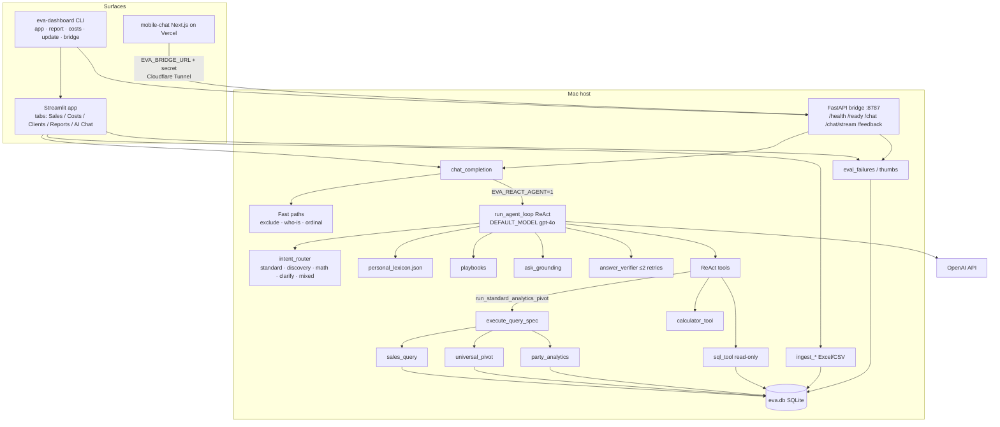

# Eva Foods Dashboard — System Overview (v1.4.4)

Stakeholder-grade architecture reference derived from the codebase on `main` (`eva_dashboard.__version__ = "1.4.4"`). Do not treat this as a product roadmap; it describes what the code does today.

---

## 1. Executive summary

**Eva Foods Dashboard** is a local Python app that:

1. Ingests sales, category, client, and cost Excel/CSV files into a SQLite database (`eva.db`).
2. Lets operators browse data and generate a Sales dashboard PDF.
3. Answers natural-language commercial questions via an OpenAI-powered chat stack whose default orchestrator model is **`gpt-4o`**.

Chat (v1.4.4) uses a **ReAct multi-step agent** (`EVA_REACT_AGENT=1` by default): an intent router classifies the ask; tools call either deterministic analytics engines (`run_standard_analytics_pivot` → QuerySpec / `execute_query_spec`) or guarded read-only SQL / a sandboxed calculator. **Money metrics** (AMS, volume pivots, Price Fetch, AMS growth/decline) are required to go through the Python engines—not reinvented in SQL. A verifier can retry bad answers up to twice. Personal lexicon, playbooks, memory context, and 👍/👎 feedback (`eval_failures`) round out production chat.

Surfaces: Streamlit desktop UI, FastAPI Mac bridge + Vercel phone UI, and a CLI (`app`, `report`, `costs`, `update`, `bridge`).

---

## 2. Product surfaces (Streamlit, bridge, mobile, CLI, update)

### Streamlit (`eva-dashboard app`)

- Entry: `eva_dashboard.app:main` via `eva-dashboard app [--port 8501] [--data-dir …]`.
- Tabs (exact labels): **Sales data**, **Cost structure**, **Client list**, **Reports**, **AI Chat**.
- Banner shows version, data root, DB filename, and launch path (must show **v1.4.4+** and `Eva-Foods-Dashboard-new` after a correct Mac install).
- AI Chat: API key (env or session paste), model select (`gpt-4o` default; also `gpt-4o-mini`, `gpt-4.1`, `gpt-4.1-mini`), markdown answers, 👍/👎 feedback, downloadable training CSV.

### Bridge (`eva-dashboard bridge`)

- FastAPI app on **`127.0.0.1:8787`** by default (`eva_dashboard.bridge`).
- Shared secret from `EVA_BRIDGE_SECRET` or auto-generated `data/bridge_secret.txt`.
- Endpoints:
  - `GET /health` — version, DB path, whether OpenAI key is configured
  - `GET /ready` — authenticated readiness (503 if no API key)
  - `POST /chat` — sync chat (calls `chat_completion`)
  - `POST /chat/stream` — SSE status events + final answer (phone latency UX)
  - `POST /feedback` — thumbs into `eval_failures`
  - `POST /export` — chat export helper for mobile
- OpenAI key and SQLite stay on the Mac; tunnel exposes only the bridge.

### Mobile chat (`mobile-chat/`)

- Next.js UI deployed to Vercel (root directory must be `mobile-chat`).
- Phone → Vercel API routes → Cloudflare Tunnel → Mac bridge.
- Env on Vercel: `EVA_BRIDGE_URL`, `EVA_BRIDGE_SECRET`.
- Proxies: `/api/health`, `/api/chat` (prefers `/chat/stream`, falls back to `/chat`), `/api/feedback`, `/api/export`.

### CLI (`eva-dashboard`)

| Subcommand | Role |
|---|---|
| `app` | Launch Streamlit |
| `report` | One-shot PDF from Excel paths (+ optional costs) |
| `costs` | Compute total factor costs CSV/XLSX from product + packing workbooks |
| `update` | Download GitHub ZIP of branch, reinstall into canonical home, preserve `data/` |
| `bridge` | Start phone chat bridge |

### Update

- Code defaults: repo `ssashfaque-creator/Eva-Foods-Dashboard`, branch **`main`**, min version **1.4.4**, install dir `~/Eva-Foods-Dashboard-new` (or `EVA_HOME`).
- One-liner: `curl …/main/scripts/update.sh | bash`.
- Refuses legacy folders matching `sales-dashboard-pdf` / `ai-chatbot-data-testing`.
- Preserves `data/`, `.venv/`, `.env`, etc.

---

## 3. Data layer (dir layout, tables, joins, formulas)

### Directory layout

Default root: `./data` (override `EVA_DATA_DIR` / `--data-dir`):

```text
data/
├── eva.db
├── personal_lexicon.json          # chat nicknames / prefs (not in SCHEMA_SQL)
├── bridge_secret.txt              # when bridge auto-generates secret
├── uploads/
│   ├── sales/
│   ├── categories/
│   ├── clients/
│   ├── product_costs/
│   └── packing_costs/
└── reports/
    └── sales_report_<date>_<timestamp>.pdf
```

### Ingest entry points (`ingest.py`)

- `ingest_sales` — append daily lines; SHA-256 file dedupe + `row_hash` line dedupe; archive under `uploads/sales/`
- `ingest_categories` — **full replace** of `category`
- `ingest_clients` — upsert by `client_id`
- `ingest_product_costs` / `ingest_packing_costs` — append lines; refresh `factor_costs` when both exist

### SQLite tables (`db.py` SCHEMA)

| Table | Behavior |
|---|---|
| `ingested_files` | Upload ledger; unique `(file_type, content_hash)` |
| `sales` | Append-only daily lines + `payload_json` |
| `category` | Product → Business Unit (`category_1`), Oil Type (`category_2`), Packing Category |
| `clients` | Upsert by `client_id`; geo = `city_filter` |
| `product_cost_lines` / `packing_cost_lines` | Historical cost sources |
| `factor_costs` | Derived snapshot PK `(client_type, prod_id)` |
| `eval_failures` | Chat 👍/👎 / weekly golden intake |

### Joins

```text
sales.product                 = category.product
normalize(sales.party)        = normalize(clients.client)
client type                   = clients.type else sales.client_type else "Unmapped"
factor_costs ↔ sales          = (resolved client type, sales.product)
product_cost_lines.prod_id    = packing_cost_lines.prod_id  (to build factors)
```

Hot sales paths prefer a Python `_clients_lookup` map over a SQL `lower(trim(…))` join (documented as too slow at scale).

### Key formulas (`data.py` / catalog)

**Effective MT**

```text
if mt_qty ≠ 0 → mt_qty
else if unit ∈ {kg, kgs} → qty / 1000
else if unit ∈ {mt, ton, …} → qty
else → 0
```

**Time windows (report date D)**

- Daily: date = D  
- MTD: month-start(D) … D  
- ADS / Avg 30D: inclusive 30 days ending D, sum ÷ 30  
- **AMS**: mean of totals for the **3 full calendar months** before D’s month  

**Price Fetch (Rs / maund)** — constants `LTR_TO_KG = 0.915`, `MAUND_KG = 37.3246`

```text
AmountPerKg = Incl GST/FED Amount / (effective_mt × 1000)
CostPerKg   = TotalFactorCost / 0.915   if unit is Ltrs
            = TotalFactorCost          if unit is Kgs
PriceFetch  = (AmountPerKg − CostPerKg) × 37.3246
```

Summary Price Fetch by client type × (Eva/Maan × Oil/Ghee) is **MT-weighted**. Bulk Oil averages also use × 37.3246 (per maund); other bulk BU averages stay per kg.

Partial-month Expected = `(days_elapsed / days_in_month) × AMS`.

---

## 4. Deterministic analytics engines (QuerySpec → execution)

### QuerySpec (`query_spec.py`)

LLM (or agent tool args) proposes a plan; Python validates and executes.

- **Period types:** `MTD`, `LAST_N_MONTHS`, `LAST_MONTH`, `LAST_WEEK`, `NAMED_MONTH`, `SPECIFIC_MONTH`, `CUSTOM_DATE`
- **Operations:** `pivot`, `party_list`, `party_lookup`, `party_profile`, `overview`, `advanced`
- **Row dims:** city, zone, party, business_unit, packing_category, product, oil_type, client_type  
- **Column dims:** month, client_type, business_unit, city, oil_type, packing_category  
- **Metrics:** `volume`, `avg_price`, `last_price`, `price_fetch`, `ams`, `vs_ams`, `ams_growth`

### Execution dispatch (`query_executor.execute_query_spec`)

Normalize → merge memory/prior → entity/vocab coercion → validate → then:

| Path | Engine |
|---|---|
| `party_list` | `list_clients` (`party_analytics`) |
| `party_lookup` / “who is …” | `lookup_party` |
| `party_profile` | `party_profile` |
| `overview` | `sales_overview` |
| `advanced` | advanced analytics dispatch |
| `vs_ams` / `ams_growth` ranks (not named-month vol+AMS packs) | `analyze_parties` |
| Cost-factor-only asks | `query_factor_costs` |
| `price_fetch` / `last_price` / fetch flags | `query_price_fetch_table` or `query_price` |
| Plain `avg_price` (+ volume) with rows | `execute_universal_pivot` |
| Volume / AMS matrix-trend-analytical | `query_sales` |

### Module roles

- **`sales_query.py`** — Core commercial pivots: MT matrices, analytical AMS mode, `query_price` / Price Fetch tables, factor cost queries, period resolution.
- **`universal_pivot.py`** — Generic rows × columns × metrics (especially volume + `avg_price` trends) built on sales_query fetch helpers.
- **`party_analytics.py`** — Client lists, party ranks (AMS / vs AMS / growth), YoY-style party views, geo/share helpers.

ReAct reaches these only through **`run_standard_analytics_pivot`** (`tools/legacy_tool.py`).

---

## 5. AI / model layer

### Default model

- `DEFAULT_MODEL = "gpt-4o"` in `chatbot.py` (UI help: ReAct orchestration; mini is cheaper for light asks).
- Timeout: `OPENAI_TIMEOUT_S = 45`.

### ReAct loop (`agent_loop.run_agent_loop`)

- Feature flag: `react_agent_enabled()` — env `EVA_REACT_AGENT` default **`1`**; `0` is deprecated `plan_query` rollback.
- Up to **8** model turns; temperature `0.1`; native tool calling with `REACT_TOOLS_SCHEMA`.
- Injects: routing block, playbooks, ask grounding, memory/golden/entity context.

### Router kinds (`tools/intent_router.route_ask`)

| Kind | Meaning |
|---|---|
| `standard` | Volume / AMS / ranks / Price Fetch → prefer pivot tool; often **blocks** `execute_read_only_sql` for AMS/PF/growth |
| `discovery` | Min/max rate, who-at-rate, dispersion → SQL + entity lookup |
| `math` | Arithmetic after fetching a number |
| `clarify` | One short question (e.g. bare “price” without qualifier) |
| `mixed` | Discovery+math or standard+math |

### Tools table (ReAct)

| Tool | Module | Role |
|---|---|---|
| `run_standard_analytics_pivot` | `legacy_tool` | QuerySpec → `execute_query_spec` |
| `execute_read_only_sql` | `sql_tool` | SELECT/WITH only; authorizer; bans PF constants / AMS invention; tables whitelisted |
| `calculate_expression` | `calculator_tool` | AST-sandboxed arithmetic |
| `get_database_schema` | `discovery_tool` | DDL + join hints |
| `lookup_entity_values` | `discovery_tool` | Distinct value search |

Deprecated path (`EVA_REACT_AGENT=0`) still exposes older tools such as `plan_query`, `query_sales`, `query_price`, `list_clients`, `analyze_parties`, `lookup_party`, etc., inside `chatbot.get_tools()` — not the default.

### Verifier (`answer_verifier.verify_agent_answer`)

Checks empty/refusal answers, math without calculator, AMS/volume/PF via SQL instead of pivot, failed tools, numeric asks without numbers. Up to **2** verify retries with a `retry_hint` user message.

### Lexicon (`personal_lexicon.py`)

- File: `{data-dir}/personal_lexicon.json`
- Seed aliases (e.g. pepsi→PEPSI, imtiaz→IMTIAZ)
- Sticky **`default_price_metric`**: clarify once → remember forever (`avg_price` / `last_price` / `price_fetch` / `min_rate` / `max_rate`)
- Learns party aliases / style from successful turns

### Playbooks (`playbooks.py`)

Multi-hop recipes injected into the system prompt when patterns match, including: `lowest_rate_then_buyer`, `highest_rate_then_buyer`, `rate_then_math`, `distributors_grown`, `distributors_declined`, `same_date_price_variance`, `who_is_then_sales`, `top_n_customers_month`, `volume_and_avg_price`, `price_fetch_followup`, `yoy_compare`, `exclude_then_refresh`, `last_price_sold`.

### Memory (`memory_context.py`)

`MemoryContext` carries filters, party scope, grain, metrics, period, excludes, matches. Prompted as JSON; `state_action` keep/modify/clear (legacy `context_handling` / `base`) drives merge into the next QuerySpec.

### Feedback (`chat_feedback.py`)

👍/👎 → `eval_failures` (route, tool trace, verify issues, model, source). Down votes intended as weekly golden-eval intake.

### Ask grounding (`ask_grounding.py`)

Expands lexicon aliases and resolves party candidates into a `GROUNDED_PARTIES` prompt block before tools run.

---

## 6. End-to-end chat turn flow (step by step)

1. **UI / bridge** collects history + new user text; resolves `OPENAI_API_KEY` and model (default `gpt-4o`).
2. **`chat_completion`** rebuilds a live system prompt (DB overview + data catalog), resolves prior specs / `query_state`, builds `MemoryContext`, golden RAG snippets, and semantic entity grounding.
3. **Fast paths** (skip full agent when they succeed):
   - Short exclude/remove follow-up on prior table → `execute_query_spec` directly  
   - “Who is X” → `party_lookup`  
   - Ordinal picks from prior who-is (“AMS for 1 and 2”) → cache or pivot  
4. If **`EVA_REACT_AGENT` enabled** (default):
   1. Learn price preference from this turn’s text if stated  
   2. **`route_ask`** → kind / preferred / blocked tools  
   3. **`ground_ask_for_agent`** + lexicon expansions  
   4. Match **playbooks** into system prompt  
   5. High-confidence **clarify** may return one question (or skip if lexicon already has a price default)  
   6. Model loop: tool_choice auto → `dispatch_react_tool` (router may soft-block tools)  
   7. On final text: **`verify_agent_answer`**; retry ≤2×  
   8. **`learn_from_turn`** updates lexicon  
   9. Attach follow-up meta (`table_spec` / `party_spec` / `query_state` / plan_debug) for Reply continuity  
5. Else (deprecated): multi-round `plan_query` / legacy tool loop in `chatbot.py`.
6. Streamlit or bridge returns markdown; optional thumb → `eval_failures`; mobile may stream status via SSE.

---

## 7. Environment variables

| Variable | Purpose |
|---|---|
| `OPENAI_API_KEY` | Required for chat / bridge |
| `EVA_DATA_DIR` | Data root (DB, uploads, lexicon, reports) |
| `EVA_REACT_AGENT` | `1` (default) ReAct; `0` deprecated plan_query loop |
| `EVA_BRIDGE_SECRET` | Bridge auth (else file under data dir) |
| `EVA_BRIDGE_URL` | Vercel/mobile → tunnel URL to Mac bridge |
| `EVA_HOME` | Canonical install directory override |
| `EVA_UPDATE_REPO` | GitHub owner/repo for update (default `ssashfaque-creator/Eva-Foods-Dashboard`) |
| `EVA_UPDATE_BRANCH` | Update branch (default **`main`**) |
| `EVA_MIN_VERSION` | Used by `scripts/update.sh` (default `1.4.4`) |

CLI `--data-dir` sets `EVA_DATA_DIR` for that process.

---

## 8. Testing / eval

- Large pytest suite under `tests/` (ingest, sales_query, universal_pivot, party analytics, ReAct tools, bridge API, memory, product language, Price Fetch, etc.).
- **Money-metric golden eval:** `eva_dashboard/golden_magic_eval.json` (version `"1.4.4"`) + `eval_harness.py` / `tests/test_golden_magic_eval.py`.
  - Offline: scores **router kind**, **playbook ids**, preferred/blocked tools, lexicon aliases.
  - Cases marked `money_metric: true` must route **`standard`**, prefer **`run_standard_analytics_pivot`**, and (for AMS / Price Fetch / grown / declined language) **block** `execute_read_only_sql`.
- CLI: `python -m eva_dashboard.eval_harness`.
- Human 👎 rows in `eval_failures` support weekly promotion into goldens.

---

## 9. Versioning & Mac install

- Package / module version: **`1.4.4`** (`pyproject.toml`, `eva_dashboard/__init__.py`, golden eval JSON, update `MIN_VERSION`).
- Install Python **3.10+**.
- Recommended:

```bash
curl -fsSL "https://raw.githubusercontent.com/ssashfaque-creator/Eva-Foods-Dashboard/main/scripts/update.sh" | bash
export OPENAI_API_KEY=sk-...
"$HOME/Eva-Foods-Dashboard-new/.venv/bin/eva-dashboard" app --data-dir ~/Documents/EvaFoodsData
```

- Keep data under `~/Documents/EvaFoodsData` (or any stable `--data-dir`) so updates never wipe sales.
- Launch with the **full path** under `Eva-Foods-Dashboard-new`; ignore stale `eva-dashboard` on PATH from old `*-sales-dashboard-pdf-*` installs.
- Phone: run `bridge` + `cloudflared tunnel --url http://127.0.0.1:8787`; set Vercel `EVA_BRIDGE_URL` / `EVA_BRIDGE_SECRET`.

---

## 10. Known limits / tech debt

- **README lag:** AI Chat section still says default **GPT-4o-mini**; code/UI default is **`gpt-4o`**.
- **CLI help lag:** `eva-dashboard update --branch` help text still mentions `cursor/phase1-single-planner-50eb`; actual default is **`main`** (`update.py` / `scripts/update.sh`).
- **`EVA_REACT_AGENT=0`** plan_query loop is deprecated and warned; kept only for emergency rollback until money goldens stay green.
- **SQL vs engines:** Agents must not invent AMS windows or Price Fetch (`37.3246` / `0.915`) in SQL; verifier and SQL bans enforce this, but discovery asks still need careful prompting.
- **Party SQL join:** Expression join on normalized names is documented as too slow; hot path uses in-memory client maps.
- **Mobile latency:** Multi-tool turns often **10–40s**; tunnel URL changes require Vercel env update + redeploy unless a named tunnel is used.
- **Category map required** for correct BU / Oil / Packing reports and chat pivots; unmapped products must be called out.
- **Clarify / price ambiguity:** Bare “price” asks interrupt until a preference is learned.
- Deploy doc still shows an older branch URL in one update example; prefer `main` after this release line.

---

## 11. Architecture diagram



---

*Generated from repository sources for Eva Foods Dashboard v1.4.4. Prefer `docs/DATA_CATALOG.md` and `docs/REACT_AGENT.md` for deeper catalog / agent notes.*
